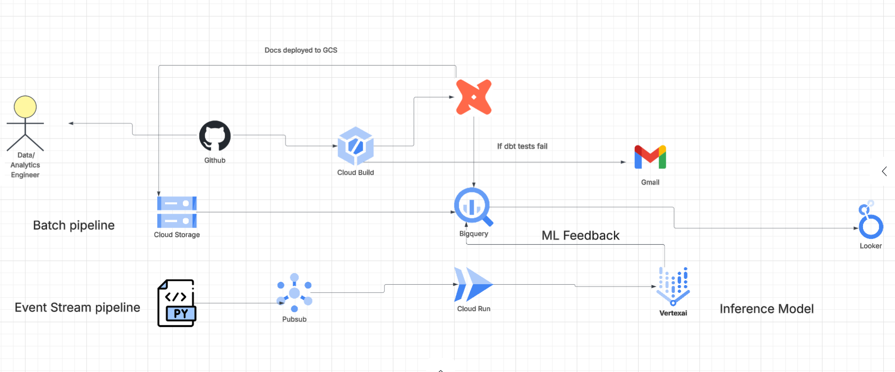
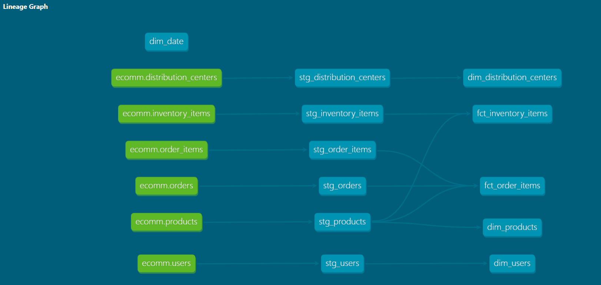
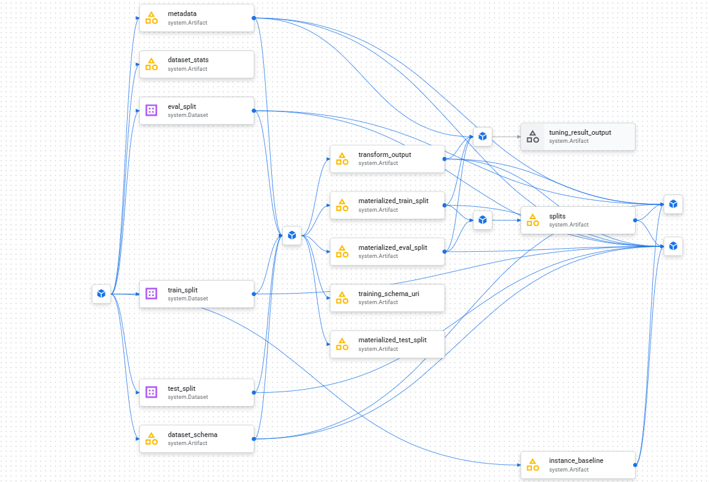
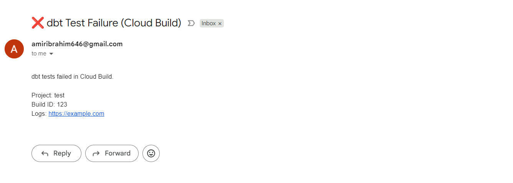

# Cloud-Native GCP Data Engineering Project

## Overview

- This repository demonstrates an end-to-end, cloud-native Data Engineering and ML pipeline on Google Cloud Platform (GCP).
- This project is based upon the public BigQuery dataset, TheLook, wich is a synthetic Ecommerce dataset made by the Looker team.

- The project leverages GCP-managed services to build a scalable ELT architecture, automate transformations using dbt, deployment of machine learning models with Vertex AI, and expose analytics through Looker Studio and orchestrated via CI/CD using Cloud Build.

The solution follows modern analytics engineering and MLOps best practices, combining:
- Data ingestion and transformation
- Analytics-ready data modeling
- Automated CI/CD pipelines
- ML model training, deployment, and inference
- Real-time event-driven processing

---

## Architecture Overview



**High-level data and ML flow:**

Source Data (GCS Bucket)<br>
&nbsp;&nbsp;&nbsp;&nbsp;&nbsp;&nbsp;&nbsp;&nbsp;&nbsp;&nbsp;&nbsp;&nbsp;&nbsp;&nbsp;&nbsp;&nbsp;↓<br>
BigQuery (Raw Dataset)<br>
&nbsp;&nbsp;&nbsp;&nbsp;&nbsp;&nbsp;&nbsp;&nbsp;&nbsp;&nbsp;&nbsp;&nbsp;&nbsp;&nbsp;&nbsp;↓<br>
dbt (Staging → Marts)<br>
&nbsp;&nbsp;&nbsp;&nbsp;&nbsp;&nbsp;&nbsp;&nbsp;&nbsp;&nbsp;&nbsp;&nbsp;&nbsp;&nbsp;&nbsp;↓<br>
Analytics (Looker Studio)<br>
&nbsp;&nbsp;&nbsp;&nbsp;&nbsp;&nbsp;&nbsp;&nbsp;&nbsp;&nbsp;&nbsp;&nbsp;&nbsp;&nbsp;&nbsp;↓<br>
ML Training (Vertex AI AutoML)<br>
&nbsp;&nbsp;&nbsp;&nbsp;&nbsp;&nbsp;&nbsp;&nbsp;&nbsp;&nbsp;&nbsp;&nbsp;&nbsp;&nbsp;&nbsp;↓<br>
Model Endpoint<br>
&nbsp;&nbsp;&nbsp;&nbsp;&nbsp;&nbsp;&nbsp;&nbsp;&nbsp;&nbsp;&nbsp;&nbsp;&nbsp;&nbsp;&nbsp;↓<br>
Real-time Inference (Pub/Sub → Cloud Run)


---

##  Key Components

### Data Engineering
- **BigQuery** as the analytical data warehouse
- **dbt Core** for ELT transformations and analytics modeling
- **Staging & Mart layers** for clean, business-ready datasets
- **dbt Docs** auto-generated and deployed as a static website on GCS

### Analytics
- Looker Studio dashboards built on dbt marts
- Fact and dimension models optimized for BI consumption

### Machine Learning
- **Vertex AI AutoML** for training a classification model
- ML use case:  
  Predict whether a lead will convert into a potential customer
- Model deployed to a Vertex AI endpoint
- Real-time inference simulated using Pub/Sub + Cloud Run

### CI/CD & Automation
- **Cloud Build** for:
  - Running dbt transformations
  - Running tests
  - Generating dbt documentation
  - Deploying dbt docs to a public GCS static site
- Fully automated pipeline triggered on GitHub commits


---

## Modeling Approach

### ELT with dbt
- **Extract & Load** handled upstream
- **Transform** using dbt inside BigQuery
- Models are:
  - Versioned
  - Reproducible
  - Tested

### Data Layers
| Layer | Purpose |
|----|----|
| Raw | Source / ingestion tables |
| Marts | Fact & dimension tables for analytics |

### Lineage Graph



## CI/CD Pipeline

The Cloud Build pipeline automatically:

1. Installs dbt
2. Runs `dbt debug`
3. Runs `dbt run` and `dbt test`
4. Generates dbt documentation
5. Deploys dbt docs to Google Cloud Storage as a static website

This ensures:
- Continuous validation of data models
- Automated documentation updates
- Consistent production deployments

---

## Analytics & Reporting

- **Looker Studio** dashboard built on dbt marts
- Looker Report Dashboard Link:
https://lookerstudio.google.com/u/0/reporting/ce9b8407-3e83-47eb-8787-40112efc6dde/page/KkGjF/edit
---

## Machine Learning Workflow

1. Using thelook events table to train ML tabular Model to preidct whether the customer will convert. 
2. Train a classification model using Vertex AI AutoML
3. Deploy the trained model to a Vertex AI endpoint
4. Simulate real-time prediction requests using a script that simulates real time events published to 
   - Pub/Sub
   - Cloud Run services
5. Capture predictions for downstream analysis and feedback loops to a bigquery feedback table.



---

## dbt Documentation

- dbt Docs are generated automatically during CI
- Deployed as a public static site on GCS
- Provides:
  - Data lineage
  - Model dependencies
  - Column-level documentation
### Docs Live Link
[dbt docs site](https://storage.googleapis.com/dbt-docs-site/index.html#!/overview)
---
## alerting 
- integrated automated Gmail alerting when dbt tests fail 



## Prerequisites

- Python 3.9+
- dbt Core
- Google Cloud SDK
- Access to a Google BigQuery project

### Local Environment Setup

```bash
python -m venv dbt-env
source dbt-env/bin/activate
pip install dbt-bigquery
```


## Tools used 
- Google Cloud Storage 
- google Cloud Run functions 
- Pub Sub 
- BigQuery 
- Looker Studio 
- Cloud Build 
- Vertex AI AutoML 
- dbt